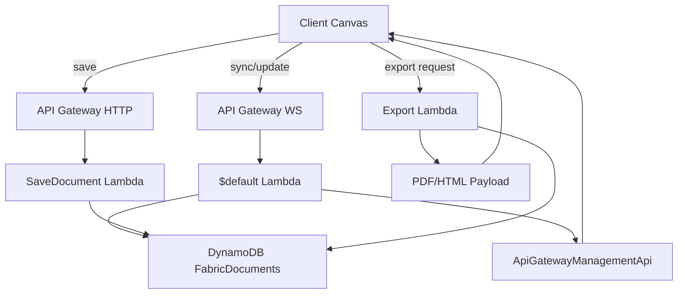
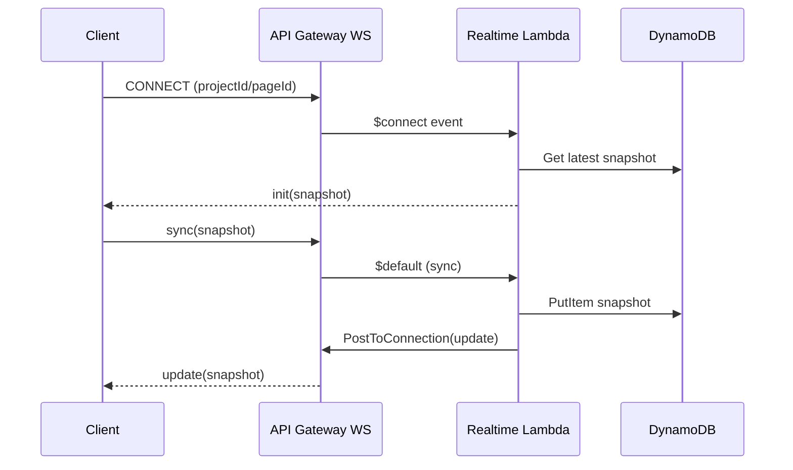
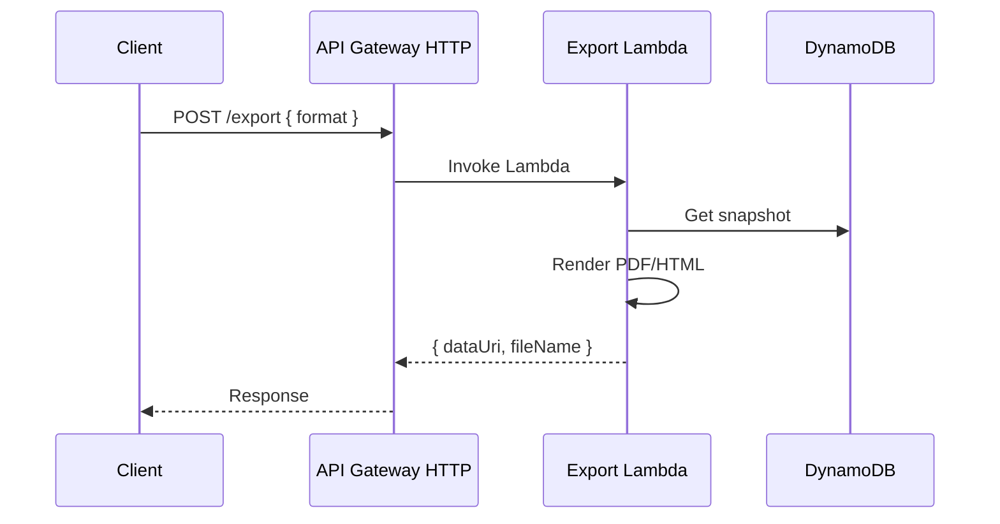

# Fabric Canvas Flow Diagrams

```mermaid
graph TD
  A[Client Canvas] -- sync/update --> B[API Gateway WS]
  B --> C[$default Lambda]
  C --> D[DynamoDB FabricDocuments]
  C --> E[ApiGatewayManagementApi]
  E --> A

  A -- save --> F[API Gateway HTTP]
  F --> G[SaveDocument Lambda]
  G --> D

  A -- export request --> H[Export Lambda]
  H --> D
  H --> I[PDF/HTML Payload]
  I --> A
```

## Sequence Diagram (Realtime Sync)

```mermaid
sequenceDiagram
  participant Client
  participant WS as API Gateway WS
  participant Lambda as Realtime Lambda
  participant DB as DynamoDB

  Client->>WS: CONNECT (projectId/pageId)
  WS->>Lambda: $connect event
  Lambda->>DB: Get latest snapshot
  Lambda-->>Client: init(snapshot)
  Client->>WS: sync(snapshot)
  WS->>Lambda: $default (sync)
  Lambda->>DB: PutItem snapshot
  Lambda->>WS: PostToConnection(update)
  WS-->>Client: update(snapshot)
```

## Sequence Diagram (Export)

```mermaid
sequenceDiagram
  participant Client
  participant HTTP as API Gateway HTTP
  participant Export as Export Lambda
  participant DB as DynamoDB

  Client->>HTTP: POST /export { format }
  HTTP->>Export: Invoke Lambda
  Export->>DB: Get snapshot
  Export->>Export: Render PDF/HTML
  Export-->>HTTP: { dataUri, fileName }
  HTTP-->>Client: Response
```
